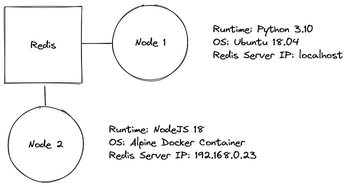

# 1. Overview of an nv network

An **nv** network (you can think of one network as a single robot) comprises of a number of different _nodes_, and a single central Redis server.

Simplified overview of an nv network.

These nodes typically have a distinct function within the robot (such as interfacing with a camera and reading images, sending commands to motor controllers, or performing processing on GPS data for SLAM).

A node should be self-contained (does not rely on other nodes specifically), and can be run on it’s own. Different nodes may be written in different languages, and may be running in different environments (containers, VMs, or even different computers entirely), and should be able to work together regardless.

<aside>
❓ Just for clarification - self-contained doesn’t mean each node has no interaction with other nodes. In fact, communication between nodes is a core part of building robots with **nv**. It just means that a node doesn’t care where the messages it’s receiving are coming from, and it doesn’t care who’s listening when it shares data with the rest of the network.
</aside>

Example of an nv network where two different nodes are running in completely different environments, yet have no issues communicating and working with eachother within the network.

We’ll get into more detail later, but for now just understand that an nv network is built on multiple different nodes all working together to form a whole.

# Next up

[2. Communicating within an nv network](./intro_2_communicating_within_an_nv_network.md)
