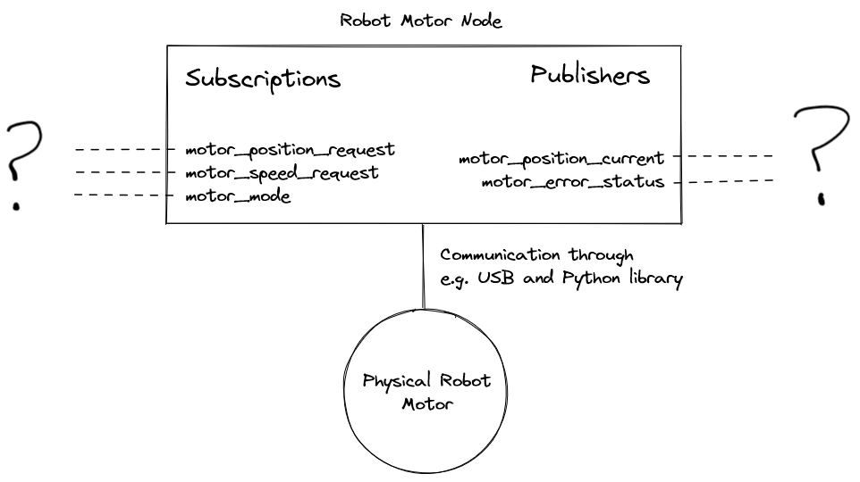
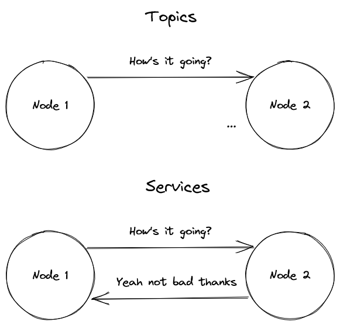

# 2. Communicating within an nv network

Communication between nodes within an **nv** network is achieved typically by one of two ways:

-   Topics
-   Services

# Topics

Topics are an implementation of a _publish/subscribe_ model of communication. Any node can chose to publish information on a particular broadcast channel (a particular topic), and any other node can choose to listen to information on said topic.

There is no inherent awareness of which nodes are listening or publishing on any particular channel. A node shouldn’t care where the information is coming from, and it shouldn’t care who is listening to information it publishes.



The name of the topic is the unique key used to distinguish between different channels of information. This should be something self-explanatory and universal, but descriptive enough to prevent confusion or conflict with other topics.

✔️ `joystick_sticks`

❌ `sticks` - too vague

❌ `xbox_controller_analogue_sticks` - recipient nodes probably don’t care if the data is from an Xbox, Playstation, or any other controller, as long as it’s in the format they expect.

<aside>
📎 Importantly, this is just a guide. The **nv** network lets you name topics nearly anything (even emojis 👀), but keeping things consistent helps sharing of code in the future.
</aside>

## Syntax

Publish a string on the topic, `"hello_world"`.

```python
self.publish("hello_world", "If not now, when?")
```

```jsx
this.publish("hello_world", "I reject your reality and substitute my own.");
```

Publish an object on the topic, `“test_topic”`.

```python
data = [
    {"name": "St James Craig", "built": 1874, "flag": "au"},
    {"name": "Elegant", "built": 1889, "flag": "nl"},
]

self.publish("test_topic", data)
```

```jsx
const data = [
    { name: "St James Craig", built: 1874, flag: "au" },
    { name: "Elegant", built: 1889, flag: "nl" },
];

this.publish("test_topic", data);
```

Subscribe to the topic `“gps_position”`.

```python
def handle_callback(self, message):
    ...

self.create_subscription("gps_position", self.handle_callback)
```

```jsx
function handleCallback(message) {
    ...
}

this.createSubscription("gps_position", this.handleCallback)
```

# Services

Services are similar to topics in that they operate on a specified channel, can be created by any node, and any other node can choose to interact with them.

The main difference is that after any _call_ to a service, the client (the node which called) expects a timely _response_ from the server (the node which created the service).



## Syntax

Call a service available at `“get_current_weather”` with no args, then a single positional argument.

```python
current_weather = self.call_service("get_current_weather")
# Sunny, 23°C

current_weather_sydney = self.call_service("get_current_weather", "Sydney, AU")
# Cloudy, 18°C
```

```jsx
const current_weather = this.callService("get_current_weather");
// Sunny, 23°C

const current_weather_sydney = this.callService("get_current_weather", [
    "Sydney, AU",
]);
// Cloudy, 18°C
```

Create a service at `“greet_me”` which returns a string.

```python
def greeting_service(self):
    return "Hello and welcome!"

self.create_service("greet_me", self.greeting_service)
```

```jsx
function greetingService() {
    return "Hello and welcome!";
}

this.createService("greet_me", this.greetingService);
```

# Data formats

One of the strengths of the **nv** framework is that data sent and received over the network can be in nearly any common format without additional configuration. You don’t need to specify the format you’re sending or receiving data in, it just works automatically.

| Data type       | Examples           | Support                      |
| --------------- | ------------------ | ---------------------------- |
| Text            | str                | Full                         |
| Numeric         | int, float, Number | Full                         |
| Sequence        | list, tuple, Array | Converted to JSON list/array |
| Object          | dict, Object       | Converted to JSON object     |
| Boolean         | bool, Boolean      | Full                         |
| Binary          | bytes, Buffer      | Full                         |
| Numpy array     | ndarray            | Converted to JSON list/array |
| Complex objects | Class, functions   | No                           |

In the rare event that you need to send complex data such as classes, or Numpy arrays with included data-types, you can serialise the data yourself (e.g. into bytes using Pickle) before sending it, and deserialise yourself on the other end.

# Next up

[3. Getting and setting parameters](./intro_3_getting_and_setting_parameters.md)
