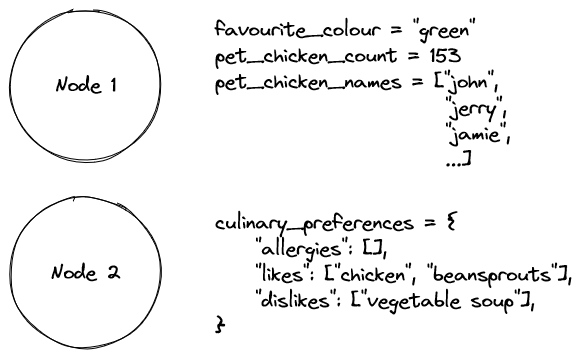

# 3. Getting and setting parameters

Parameters are a means of having persistent, but modifiable variables available to nodes.

They may be used for stuff like device paths when accessing hardware, or robot-specific configuration like maximum motor speed. Anything that isn’t constant enough to be hard-coded into a node, but should be more persistent and flexible than environment variables.

Parameters are intended to be specific to each node, however it is possible to access other nodes’ parameters if you need to.



Parameters must be a supported JSON data type, i.e. any standard data type or JSON-compatible object.

You can also have nested parameters (hierarchical parameters), by using dot-notation. For example, `Node 1` in the example above could have parameters:

```
pet_chicken_count
pet_chicken_names
```

Or alternatively:

```
chickens.count
chickens.names
```

Actually, that’s what `Node 2` in the example has already done. Accessing their culinary preference likes can be achieved through:

```
culinary_preferences.likes
```

Getting a parameter is easy, and can be done at any point within a node.

```python
current_menu = self.get_parameter("current_menu")
```

```jsx
const currentMenu = await this.getParameter("current_menu");
```

Setting a parameter can be done in several ways. The simplest is with a declarative function:

```python
self.set_parameter("current_menu", ["Tomato soup", "Pork and apple sauce", "Chocolate trifle"])
```

```jsx
this.setParameter("current_menu", [
    "Tomato soup",
    "Pork and apple sauce",
    "Chocolate trifle",
]);
```

You can also set more than one parameter at once:

```python
self.set_parameters(
    [
        {
            "name": "menu2",
            "value": ["Houmous platter", "Fried plantain", "Toasted marshmallow cookie"],
        },
        {
            "name": "menu3",
            "value": ["Deep fried scorpions", "The sensation of time itself", "Stir-fried regret"],
        },
    ]
)
```

```jsx
this.setParameters([
    {
        name: "menu2",
        value: [
            "Houmous platter",
            "Fried plantain",
            "Toasted marshmallow cookie",
        ],
    },
    {
        name: "menu3",
        value: [
            "Deep fried scorpions",
            "The sensation of time itself",
            "Stir-fried regret",
        ],
    },
]);
```

More often than not, however, it makes more sense to store the parameter values in separate _config files_. They can be in JSON or YAML format (only JSON for Node.js nodes).

```yaml
node1:
    param1: value1
    param2: value2

    subparam:
        subparam1: value1
        subparam2: value2
```

```json
{
    "node1": {
        "param1": "value1",
        "param2": "value2",

        "subparam": {
            "subparam1": "value1",
            "subparam2": "value2"
        }
    }
}
```

These files can be stored somewhere accessible by the running node, and can be parsed and set automatically with:

```python
self.set_parameters_from_file(CONFIG_FILE_PATH)
```

```jsx
this.setParametersFromFile(CONFIG_FILE_PATH);
```

# Next up

[4. Installing the nv framework](./intro_4_installing_the_nv_framework.md)
