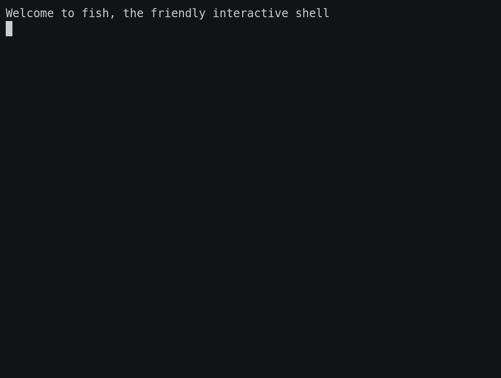
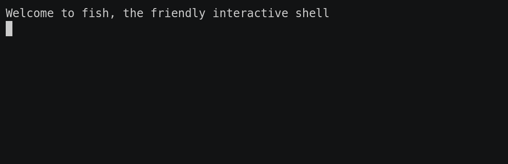
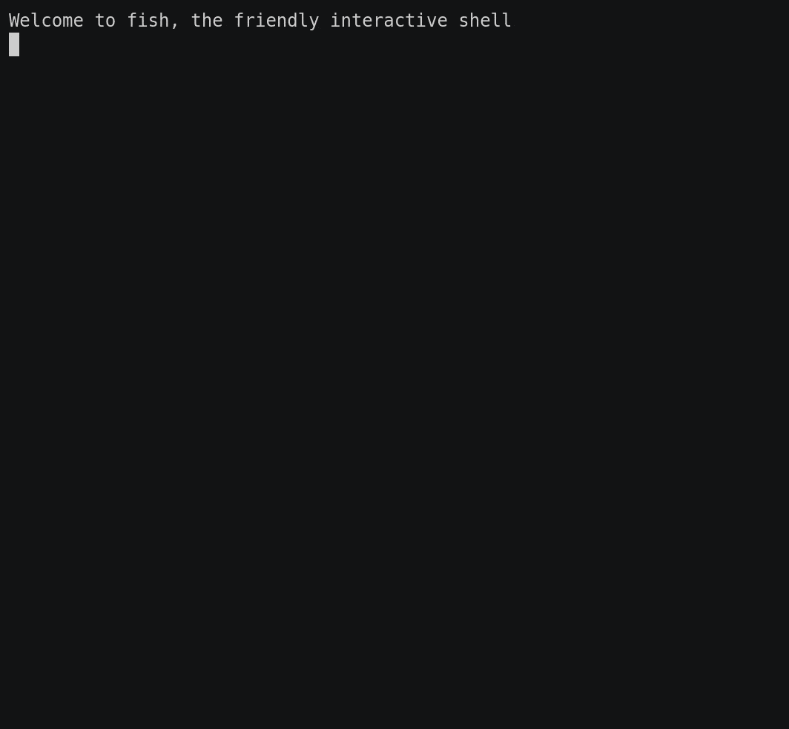
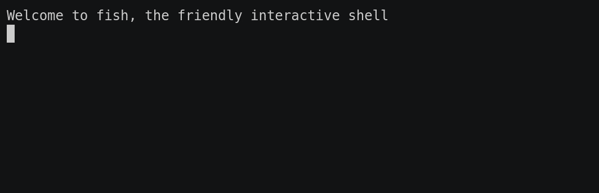
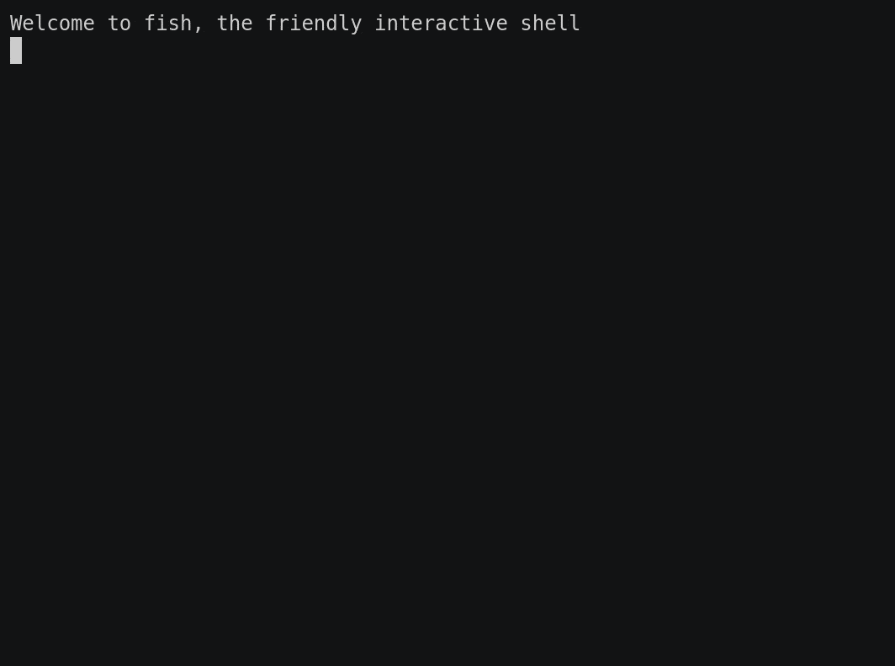
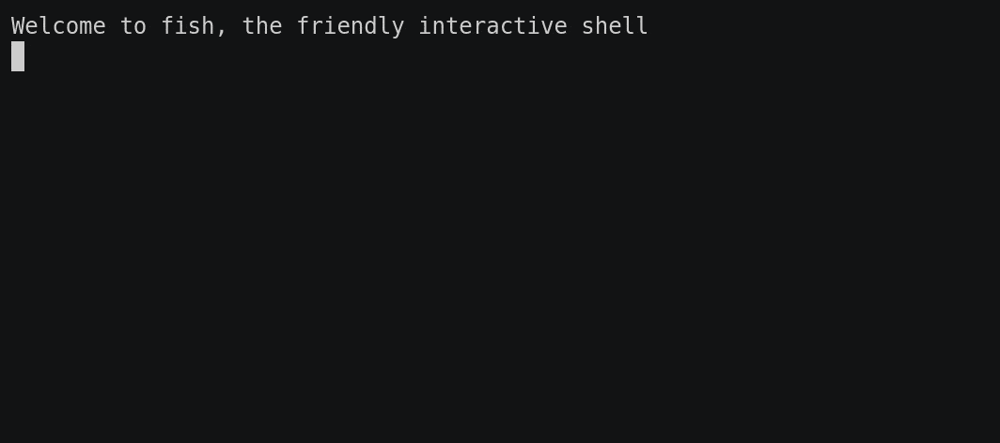

# 5. nvcli - Command line tools

After installing **nv** (only the Python version is supported at this time), you gain access to **nvcli**, a command line interface for the **nv** network. This can be used for monitoring of nodes and communications between them, debugging, and manually interacting with the **nv** network.

The help text can be launched with the command `nv`

<aside>
⚠️ Depending on how your environment is set up, you may have to launch **nv** using `python -m nv`

</aside>

Currently there’s not much going on within the **nv** network, so for now we can use some of the provided examples to create some traffic on the network.

Locate the provided examples folder (or clone the repo from GitHub), and run all the following examples:

-   `publisher.[py|js]`
-   `subscriber.[py|js]`
-   `parameters.[py|js]`
-   `service_server.py|serviceServer.js`

# `nv node`

First up, we should have a look at all the nodes we’ve just spawned. The `node` command is used to see which nodes are present on the network, and get information about them.

Run `nv node list` to display the currently running nodes.

Maybe we want to find out more information about the `publisher_node` node. Run `nv node info [NODE_NAME]` to see more information.

# `nv topic`

Topics are the primary means of communication between nodes. Similarly to the `node` command above, we can use `nv topic list` to see which topics are in use on the **nv** network.

To monitor what’s being sent over a topic, use `nv topic echo`.

Conversely, we can use `nv topic pub [TOPIC_NAME] [DATA]` to publish to a topic.

# `nv service`

We can see which services are available on the network by running `nv service list`.

We can call a service using `nv service call [SERVICE_NAME] -a {ARG} -k {KWARG}`

# `nv param`

Finally we have the ability to interact with parameters. Unlike the previous **nv**cli commands, the `param` commands are all node-specific, meaning a node name must be supplied each time.

List all parameters which currently exist for a node using `nv param list [NODE_NAME]`.

We can get the value of a single parameter with `nv param get [NODE_NAME] [PARAM_NAME]`.

Perhaps more excitingly, we can also set or modify the values of parameters using `nv param set [NODE_NAME] [PARAM_NAME] [VALUE]`. If the parameter doesn’t already exist it will be created.

Parameters don’t have to be set on nodes which already exist, any node is valid even if it’s not running. Furthermore, all valid stringified JSON is allowed as the value, and it will be parsed automatically within the node.

# Next up

[Writing your first node (Python)](./tutorial_1_writing_your_first_node_python.md)

[Writing your first node (JavaScript)](./tutorial_1_writing_your_first_node_javascript.md)
