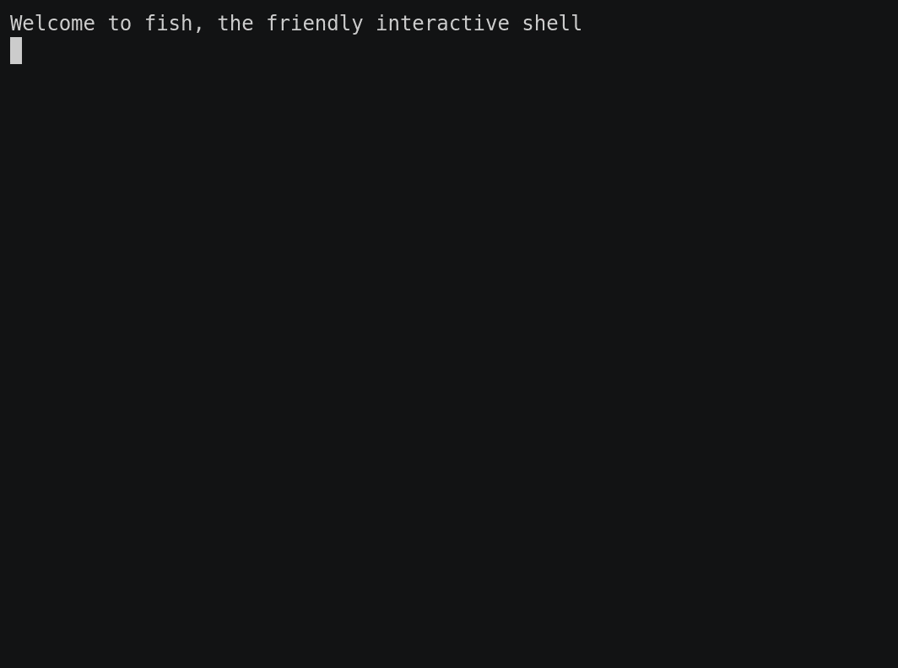

# Writing your first node (Python)

Wow, now you have a good overview of what the **nv** network is, and how it’s supposed to work, it’s about time to start writing your own nodes!

Ensure the Redis server is running and accessible, launch your favourite text editor or IDE, and create a new file called `my_first_node.py`.

Every node is built off the `Node` class, which can be imported from the `nv` package.

```python
from nv import Node
import time
```

This `Node` class is used as the base to build the rest of your node. We will be focussing on an object-oriented approach to programming from this point on, however the class can be used in a more functional approach as well.

Inherit the `Node` class into our own class, `HelloWorldNode`, and add an initialisation method. The `__init__` method is already used by the parent `Node` class to perform important initialisation steps, so it’s vital to call that parent method. It’s best to do that before any other initialisation code.

```python
class HelloWorldNode(Node):
    def __init__(self):
        super().__init__("my_first_node")
```

<aside>
💡 Define the name of the node by passing it to the `__init__` method as an argument.

</aside>

This initialisation function is a good place to put any one-time run code, such as creation of global variables, spawning of timers, serial connections to hardware, etc.

Let’s add a class variable called `current_emotion`, which we will initialise to an empty string and will be updated later. Let’s also create a subscription to the topic `internal_thoughts`. The callback function supplied is the function that’s called when a new message is received.

Finally let’s call the function `publish_emotions`, which we will write later.

```python
        self.current_emotion = ""
        self.create_subscription("internal_thoughts", self.process_thoughts)
        self.publish_emotions()
```

Let’s create that callback function now. The message received is the first positional argument. In this case, the message received should be a string, so we can log a warning if it’s not. The class’ `log` method allows different error levels and provides consistent formatting for log messages.

```python
    def process_thoughts(self, msg):
        # Ensure the message is a string
        if not isinstance(msg, str):
            self.log.warning("Received non-string message")
            return
```

Let’s search the message received for any emotion text, and update the current emotion variable if we find anything.

```python
        # Search the message for an emotion
        if "happy" in msg:
            self.current_emotion = "happy"
        elif "sad" in msg:
            self.current_emotion = "sad"
        elif "angry" in msg:
            self.current_emotion = "angry"
```

As we know, robot brains are only capable of feeling these three basic emotions, so we’ve covered all the bases here. I’ll leave you to improve the implementation of emotion checking if you feel like a challenge.

Let’s write the other function, `publish_emotions`. The important lines are the `publish` method, which allows publishing of data onto the **nv** network, and the line which monitors the `stopped` event, used to ensure any loops exit when the node is terminated.

```python
    def publish_emotions(self):
        while not self.stopped.is_set():
            self.publish("emotions", self.current_emotion)
            time.sleep(1)
```

We now have everything we need for our new `HelloWorldNode` class. To keep it’s simple, the next lines just create and start the node.

```python
hello_world_node = HelloWorldNode()
```

<aside>
🚨 It’s good convention to wrap your launch node in a `main` function, which only runs if the script is executed directly. We haven’t done that here just to simplify things.

</aside>

All together, your node should look like this:

```python
import time

from nv import Node

class HelloWorldNode(Node):
    def __init__(self):
        super().__init__("my_first_node")

        self.current_emotion = ""
        self.create_subscription("internal_thoughts", self.process_thoughts)
        self.publish_emotions()

    def process_thoughts(self, msg):
        # Ensure the message is a string
        if not isinstance(msg, str):
            self.log.warning("Received non-string message")
            return

        # Search the message for an emotion
        if "happy" in msg:
            self.current_emotion = "happy"
        elif "sad" in msg:
            self.current_emotion = "sad"
        elif "angry" in msg:
            self.current_emotion = "angry"

    def publish_emotions(self):
        while not self.stopped.is_set():
            self.publish("emotions", self.current_emotion)
            time.sleep(1)

hello_world_node = HelloWorldNode()
```

Launching the node should display some debug information, finishing with a successful registration message. Terminate the node by sending a SIGINT command, typically by pressing `Ctrl+c`.



To test it’s working, let’s open two new terminals. In the first one, use **nv**cli to echo the output of the `emotions` topic. In the second, experiment with publishing data to the `internal_thoughts` topic.


# Improvements to the node

Although the node written is perfectly functional, there are some improvements which we can make. One issue with our implementation is that upon receiving a termination signal the loops will continue waiting (from `time.sleep`) for up to a whole loop duration. This doesn’t matter much here where the loop duration is 1 second, but with loops of minutes or hours, this could cause major issues.

The **nv** framework provides helper functions for long-running loops, such as the one we created above.

We can use the `create_loop_timer` to create a separate thread which calls a specified function every n seconds. Termination when the node is destroyed is handled automatically. Additional arguments are passed to the function being called.

```python
# self.publish_emotions()
self.create_loop_timer(1, self.publish, "emotions", self.current_emotion)

self.spin()
```
